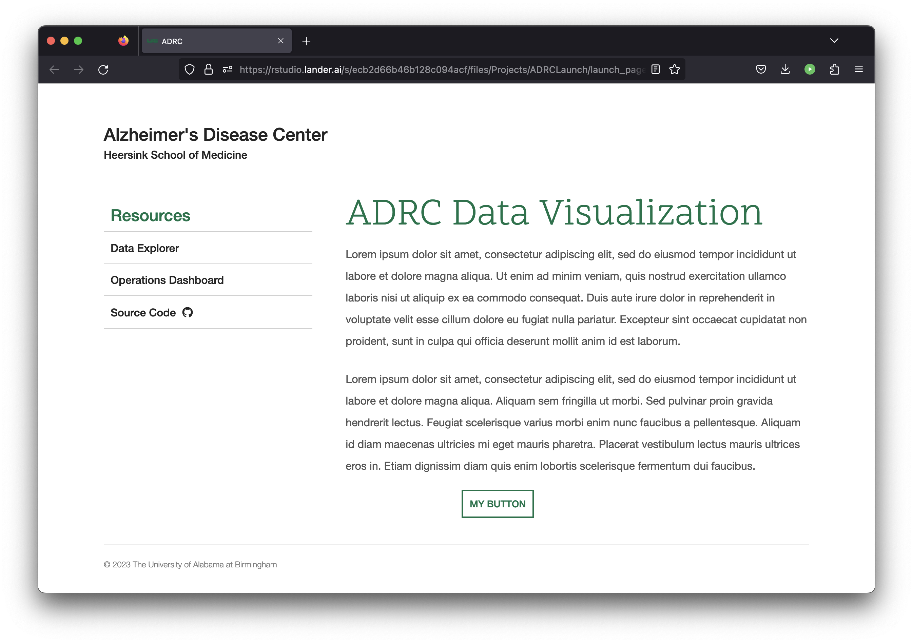

# Launch Page for ADRC Dashboards

This generates a static webpage to be hosted on Posit Connect. The page contains links to the ADRC dashboards. It is styled off the official UAB website.

 

 

## Publishing

The page can be published to Posit Connect by opening `launch_page.Rmd` and pressing the blue button in the top right. Only the rendered document, not the source code, should be published.

A short url should be created from within Connect. On the right hand settings panel, enter a name under "Content URL".
